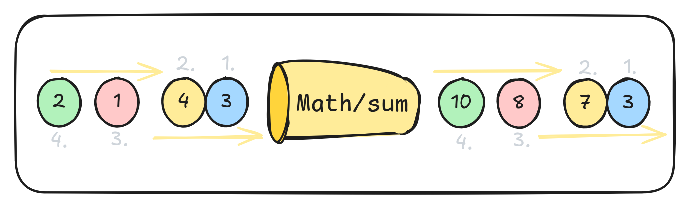
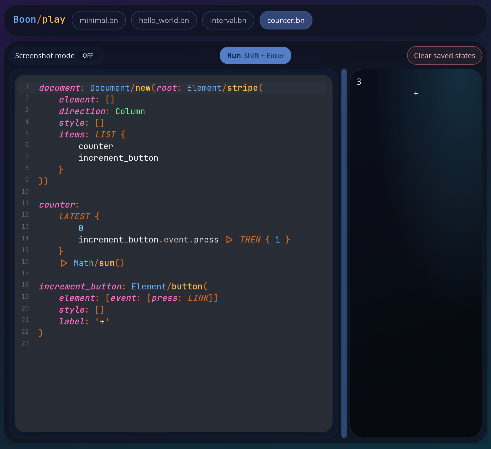
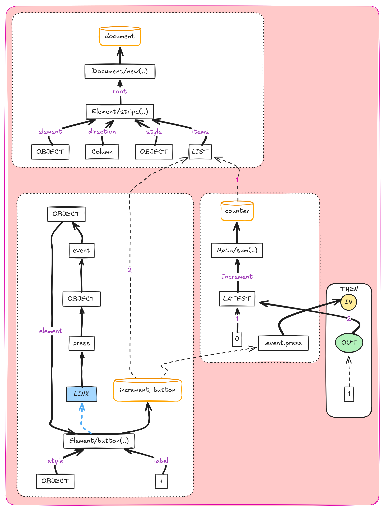

```                
 ▄▄                                     
 ██                                     
 ██▄███▄    ▄████▄    ▄████▄   ██▄████▄ 
 ██▀  ▀██  ██▀  ▀██  ██▀  ▀██  ██▀   ██ 
 ██    ██  ██    ██  ██    ██  ██    ██ 
 ███▄▄██▀  ▀██▄▄██▀  ▀██▄▄██▀  ██    ██ 
 ▀▀ ▀▀▀      ▀▀▀▀      ▀▀▀▀    ▀▀    ▀▀
 programming language bridging worlds
```
> noob or hacker, web or chip,  
boon will guide your coding trip

## First Look

**1**...  **2**...  **3**...  every second  


**1**...  **2**...  **3**...  on a button click


You can try out the examples on [play.boon.run](https://play.boon.run/)

## Super Counter

- Do you like open source?
- Do you like small computers like Raspberry Pi?
- Do you like hardware or FPGA boards like iCESugar? 


- Would you like to program and configure everything in one language?
- Would you like to unplug it whenever you want to without losing data?


What's on that diagram? Super counter!

1. You press a button on the iCESugar dev board.
2. The board sends message to the Raspberry computer.
3. The computer increments counter in its database.
4. The board, the CLI (_command-line interface_) and the web app are notified that counter value has changed.
5. The board will turn on the LED for a moment to signal that the counter has been incremented.
6. The Web app will update the rendered counter value and change its color according to the defined rules by a script (e.g. green when the counter is less than 10, otherwise red).
7. The CLI will display the new counter values and run a configured command (e.g. to show a notification or to write something into the terminal/console).
8. You can watch how data flow in the entire Super counter on the Monitor.

## Flow Combinators

### LATEST


- The first value flying in is the first one flying out.
- When it's not possible to determine what value was the first by time, then the order in the LATEST block matter: `LATEST { first, second }`.
- LATEST combinator works also across code changes. It means when you run the code `LATEST { 1, 2 }`, change the code to `LATEST { 3, 2 }` and run the program again, the values coming out from that combinator will be: `1` then `2` and then `3`. Number `2` has not been changed so it does not fly out on the second run.


- **EXTRA:** `Math/sum(increment<Number>) -> Number` and other function calls, operators and combinators are actually _actors_. It means a stream of data flows inside and outside of them and they keep their internal state. In case of `Math/sum`, it remembers a current sum and output it on every change, resp. on every new incoming value.



### WHILE


- Let's say you have sensors counting cars on two roads:
    1. `input_a` is the changing sum of the cars passed on the road `A`
    2. `input_b` is the changing sum of the cars passed on the road `B`
- Both inputs are connected to your fancy computer when you can switch between their:
    1. `Addition` - to know how many cars were on both roads
    2. `Subtraction` - to know which road is more used
- It means when `input_a` is `15` and `input_b` is `7`, you can see either `22` or `8` and the actual value is changing in realtime with every car passing by.  


### WHEN


- Bob doesn't have such fancy computer. Bob has a paper and a pen.
- Every time he wants to record `Addition` or `Subtraction`, he has to write the result down.
- It means he loses input values between his writings, but written results never change.
- Everything inside the `WHEN { ... }` block is "frozen in time" when an _input value_ arrives (`Sub` or `Add` on the diagram below, `operation` in the code above) - values are copied and they do not change according to their _dependencies_ (`A` and `B` in the diagram, `input_a` and `input_b` in the code). 


### THEN


- Alice has only a paper and pen like Bob but she is just writing down additions.
- `THEN` is basically `WHEN` without _arms_ (`Abc => 123`). You would be able to replace `THEN { 123 }` with `WHEN { __  => 123}`, that means you don't care about actual input value, you just want to do something when new input value arrives. 


### Summary

- Data flow continuosly **WH**ILE an arm is selected.
- Data are copied **WH***EN* an arm is selected.
- Input arrived and TH*EN* data are copied.

### Real-world examples 
1. When the user presses Enter or clicks a send button in your chat application, you want to use WHEN or THEN to copy message written in the new message text input. With WHILE combinator you'd risk to change already sent messages on every text input change.
2. Use WHILE for changing texts in your multilingual application. With WHEN/THEN you'd risk to update all dynamic texts only when the user decides to switch the language.

## Durable State & Code Changes

Every program is a living organism, sooner or later you'll want to change its code but ideally not lose any data during the process or tell your users to not use your app during the weekend while you are "migrating data".

Let's say we want to upgrade our simple counter example - rename the variable `counter` to `counter_2` and increment its value by 2 on a button click.

It would be pretty straightforward operation but we don't want to reset our counter value while deploying new app version.

You can go to [play.boon.run](https://play.boon.run/), click the button `counter.bn` in the header and follow the steps below with me.

1. Look at the original counter code, Run it and press the `+` button to change counter state a bit.

2. Add `counter_2` definition, replace `counter` with `counter_2` in HTML document items, prevent old `counter` listening to button press events. Also include old `counter` in `counter_2`'s LATEST blocks to do actual state migration from old to new counter. Then Run the example again. Nothing should change visually but we already use the upgraded app.

3. Remove references to old `counter` and its definition alone and we are done!

4. When you want to reset counter, click the button **Clear saved state** just above the preview pane on the playground to remove all states stored in the browser's LocalStorage and then click the button **Run** button to restart the app to see the changes - counter is reset back to 0.

**EXTRA:** Variables in our playground examples are stored in the browser. However, the general ideas is that some variables in your app will be stored in the browser, some variables in a standard database, and some of them nowhere to save memory or quickly forget things like passwords or tokens.

## All roads lead to ~~Rome~~ `document`



Look at that counter example dataflow diagram again. Do really all paths lead to the `document`? Almost! The only exception is that blue `LINK` rectangle and the bottom left corner coming from `Element/button(..)` function call. 

What is that `LINK` good for? Why does it make the only loop in the entire diagram to ruin my otherwise perfect tree?!

Look at the counter code again:


1. Notice the `press: LINK` object field be passed to the `Element/button` function call as a part of the `element` argument.
2. Function `Element/button` transforms our arguments to a data structure compatible with element tree digestable by `Document/new` function.
3. Boon browser runtime finds global `document` variable and create browser elements described in the passed element tree. When it finds `event.press`, it _links_ it with events produced by those browser HTML/DOM elements.
4. When linked, you can listen for new events with code like `my_button.event.press |> THEN { .. }`

So, for our current understanding, `variable_name: LINK` basically mean that the variable's value can be set **after** the variable is defined - no other variables can be set once they are defined.

## Finally, perfect trees!

We cannot really get rid of all loops in dataflow graphs - they are natural part of programs and things we do - we can only monitor them and try to remove accidental infinite loops.

However, look at this nice forest!:


- In Boon, every piece of state has a place in the _ownership hierarchy_.
Detach an _object_ or a _list_, and all of its descendants vanish with it.
Nothing is “freed” manually — the runtime simply drops what’s no longer owned, whether data or actors.
- Global variables - `document`, `counter`, `increment_button` - own all other items in our counter example. Everything has only one owner - it's the place where it was defined, everything else is just a _reference_ marked with dashed arrows.
- That's why `LINK` is actually a link/reference - the variable defined with `LINK` doesn't _own_ the linked browser element (notice the blue dashed OBJECT at the bottom of the state diagram above).

## Enough diagrams! More code!


### PASS + PASSED

Notice in the code above: 

1. `root_element(PASS: store)`
2. `FUNCTION root_element()`  
3. `PASSED.elements.increment_button`

The only purpose is to _pass_ data through multiple function calls without the need to mention them explicitly among function arguments.

Without PASS + PASSED, the same lines would look like:
1. `root_element(store: store)` or `store |> root_element()`
2. `FUNCTION root_element(store)`   <- new function argument
3. `store.elements.increment_button`

So PASS + PASSED is useful when you have deep function call tree (typically element tree) and bottom levels need something from top levels.

### LINK { .. }

You already know what `variable: LINK` means and now you'll find out how to set it by yourself (instead of setting it by Boon runtime). 

Notice these line: 

1. `decrement_button: LINK`
2. `counter_button(label: '-') |> LINK { PASSED.elements.decrement_button }`

Element data returned from `counter_button` function call are _linked_ to `decrement_button` and returned from `LINK {}` without any changes. 

## Where is Fibonacci??


This idea was driven be design decisions to avoid recursions and keep loops as tight and hidden as possible. However, I want the Boon design to be driven by real applications so I'll revisit this API/example when need for channels, (infinite) streams, generators, lazy evaluation, tail recursions or other related concepts emerges.

## See the Problem, Fix the Flow

1. A monitor/debugger is your friend. Have you ever played Factorio-like game? I want to:
    - SEE the problem.
    - See statistics.
    - Be able to immeditelly fix the problem.
    - Want to know why the problem happened.
    - Want to see slow parts.
    - Want to see loops.
    - Want to see what is waiting and why.
    - Want to just watch and enjoy it while everything works as expected.
    - Want to be notified when something fails. 
Just show me! Yes, you understand correctly, monitoring and short feedback loop have a high priority for Boon tools and design in general. 

2. A compiler is your friend. Nice error messages, fast type checking, hints. 


3. A formatter is your friend. No need to think about the correct number of spaces. No confusing code diffs. Constant reading speed for code reviewer.

## Status & Future

A lot of things have to be implemented and explained, but the core is there and I don't plan to stop!

Examples in [play.boon.run](https://play.boon.run/) are guaranteed to run, I'll continuously add more there and then also examples running outside of browser environment will appear.

Questions ▷ martin@kavik.cz

## Credits

- ASCII Art: [patorjk.com + Mono 12](https://patorjk.com/software/taag/#p=display&f=Mono+12&t=boon&x=none&v=4&h=4&w=80&we=false)
